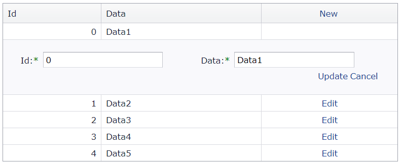

<!-- default badges list -->

[](https://supportcenter.devexpress.com/ticket/details/E2945)
[](https://docs.devexpress.com/GeneralInformation/403183)
<!-- default badges end -->
# Grid View for ASP.NET Web Forms - How to edit a data table stored in a ViewState
<!-- run online -->
**[[Run Online]](https://codecentral.devexpress.com/128539743/)**
<!-- run online end -->

This example demonstrates how to create a data table and grid control at runtime and use the grid's server-side events to update the data table.



## Overview

Create a data table at runtime and save it to a ViewState.

```cs
private DataTable CustomDataSourse {
    get {
        if (dataTable != null)
            return dataTable;

        dataTable = ViewState["CustomTable"] as DataTable;
        if (dataTable != null)
            return dataTable;

        dataTable = new DataTable("CustomDTable");
        dataTable.Columns.Add("Id", typeof(Int32));
        dataTable.PrimaryKey = new DataColumn[] { dataTable.Columns[0] };
        dataTable.Columns.Add("Data", typeof(string));

        // ...
        ViewState["CustomTable"] = dataTable;

        return dataTable;
    }
}
```

Create a grid control at runtime and set its [EnableCallbacks](https://docs.devexpress.com/AspNet/DevExpress.Web.ASPxGridBase.EnableCallBacks) property to `false` to enable postback mode. This mode allows you to store data in a ViewState.

```cs
private void CreateGrid() {
    ASPxGridView grid = new ASPxGridView();
    grid.ID = "grid";
    this.Form.Controls.Add(grid);
    grid.EnableCallBacks = false;
    grid.KeyFieldName = "Id";
    // ...
}
```

Update the data table in the corresponding grid's event handlers and bind the grid to the updated data table.

```cs
private void UpdateData(ASPxGridView g) {
    ViewState["CustomTable"] = dataTable;
    g.DataBind();
}
```

## Files to Review

* [Default.aspx](./CS/WebSite/Default.aspx) (VB: [Default.aspx](./VB/WebSite/Default.aspx))
* [Default.aspx.cs](./CS/WebSite/Default.aspx.cs) (VB: [Default.aspx.vb](./VB/WebSite/Default.aspx.vb))

## Documentation

* [Callbacks](https://docs.devexpress.com/AspNet/402559/common-concepts/callbacks)
* [Grid View - How to implement CRUD operations with a custom data source](https://docs.devexpress.com/AspNet/403771/troubleshooting/grid-related-issues/crud-operations-with-custom-data-source)

## More Examples

* [Grid View for ASP.NET Web Forms - How to edit a data table stored in a session](https://github.com/DevExpress-Examples/aspxgridview-how-to-edit-data-in-a-datatable-at-runtime-when-data-is-stored-in-session-t191009)
* [Grid View for ASP.NET Web Forms - How to edit an in-memory data set with a master-detail relationship](https://github.com/DevExpress-Examples/aspxgridview-edit-in-memory-dataset)
